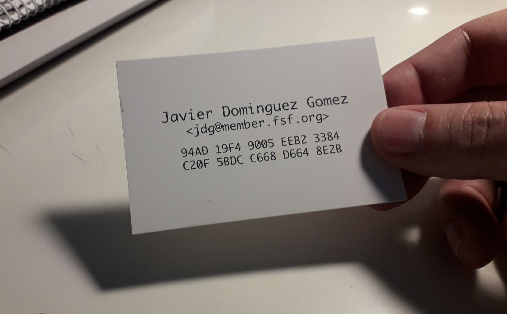

# Tutorial: GnuPG

**GNU Privacy Guard** ([GnuPG](https://gnupg.org/) o GPG) es una herramienta de cifrado y firmas digitales desarrollado por *Werner Koch*, que viene a ser un reemplazo del **Pretty Good Privacy** ([PGP](https://en.wikipedia.org/wiki/Pretty_Good_Privacy)) pero con la principal diferencia que es [Software Libre](https://en.wikipedia.org/wiki/Free_software) licenciado bajo licencia [GPLv3](https://en.wikipedia.org/wiki/GNU_General_Public_License#Version_3). GPG utiliza el estándar del IETF denominado [OpenPGP](https://en.wikipedia.org/wiki/Pretty_Good_Privacy#OpenPGP).

Para seguir los pasos de esta guía primero debes tener instalado en tu sistema **GnuPG**.
```bash
~$ sudo apt install gnupg
```

## Crear un par de claves (publica/privada) nuevas

1. Lo primero que debes hacer es generar un par de claves (pública/privada) asociados a tu nombre, apellidos y una dirección de email. El siguiente comando iniciará un diálogo interactivo que deberemos ir cumpliementando con nuestras preferencias y datos, por ejemplo:
    ```bash
    ~$ gpg --full-generate-key
    gpg (GnuPG) 2.2.4; Copyright (C) 2017 Free Software Foundation, Inc.
    This is free software: you are free to change and redistribute it.
    There is NO WARRANTY, to the extent permitted by law.

    Por favor seleccione tipo de clave deseado:
       (1) RSA y RSA (por defecto)
       (2) DSA y ElGamal
       (3) DSA (sólo firmar)
       (4) RSA (sólo firmar)
    Su elección: 1
    ```
    He elegido la opción 1, las claves RSA me valen perfectamente.

    A continuación te pide la longitud de la clave, yo he elegido la longitud máxima, que es `4096` bytes:
    ```bash
    las claves RSA pueden tener entre 1024 y 4096 bits de longitud.
    ¿De qué tamaño quiere la clave? (3072) 4096
    El tamaño requerido es de 4096 bits
    ```

    Ahora toca elegir la caducidad de la clave, yo voy a elegir que no caduque nunca, opción `0` y confirmar con `s`:
    ```bash
    Por favor, especifique el período de validez de la clave.
             0 = la clave nunca caduca
          <n>  = la clave caduca en n días
          <n>w = la clave caduca en n semanas
          <n>m = la clave caduca en n meses
          <n>y = la clave caduca en n años
    ¿Validez de la clave (0)? 0
    La clave nunca caduca
    ¿Es correcto? (s/n) s
    ```

    Ahora hay que introducir un identificador de usuario, yo pondré mi nombre y apellidos (mejor caracteres ASCII, sin acentos ni caracteres especiales):
    ```bash
    GnuPG debe construir un ID de usuario para identificar su clave.

    Nombre y apellidos: Javier Dominguez Gomez
    ```

    Dirección de email, esto es importante para asociar las claves a una cuenta de correo que luego podrán usar otras personas para comunicarse contigo de forma más segura:
    ```bash
    Dirección de correo electrónico: jdg@member.fsf.org
    ```

    También un comentario, es opcional, puedes poner algo que te identifique o dejarlo en blanco, yo pondré un mensaje para que se vea cómo quedaría:
    ```bash
    Comentario: With Free Software you have freedom!
    ```

    Finalmente nos hace un resumen de nuestras elecciones y nos permite modificarlas o confirmarlas. Si todo está bien podemos pulsar `V` e *intro*:
    ```bash
    Ha seleccionado este ID de usuario:
        "Javier Dominguez Gomez (With Free Software you have freedom!) <jdg@member.fsf.org>"

    ¿Cambia (N)ombre, (C)omentario, (D)irección o (V)ale/(S)alir? V
    ```
    Al pulsar *intro* nos pedirá añadir un *passphrase* o contraseña. **Esta contraseña es importantísima**, es la que no debemos olvidar jamás, ya que se utilizará para cifrar y descifrar con nuestra clave privada. Pedirá introducirla dos veces. Si la perdemos u olvidamos ya no podremos descrifrar nuca más la información que fuera cifrada anteriormente.

    En este momento se estará generando la clave, para ello empleará varios bytes "aleatorios" que podremos generar con el simple hecho de mover el raton por la pantalla. Hay que hacerlo durante unos pocos segundos hasta que se devuelva el prompt de la consola:
    ```bash
    Es necesario generar muchos bytes aleatorios. Es una buena idea realizar
    alguna otra tarea (trabajar en otra ventana/consola, mover el ratón, usar
    la red y los discos) durante la generación de números primos. Esto da al
    generador de números aleatorios mayor oportunidad de recoger suficiente
    entropía.
    Es necesario generar muchos bytes aleatorios. Es una buena idea realizar
    alguna otra tarea (trabajar en otra ventana/consola, mover el ratón, usar
    la red y los discos) durante la generación de números primos. Esto da al
    generador de números aleatorios mayor oportunidad de recoger suficiente
    entropía.
    gpg: clave DFCD16F1B1958BAD marcada como de confianza absoluta
    gpg: certificado de revocación guardado como '/home/jdg/.gnupg/openpgp-revocs.d/AB0553A482A6D69311CD4C8DDFCD16F1B1958BAD.rev'
    claves pública y secreta creadas y firmadas.

    pub   rsa4096 2020-05-08 [SC]
          AB0553A482A6D69311CD4C8DDFCD16F1B1958BAD
    uid                      Javier Dominguez Gomez (With Free Software you have freedom!) <jdg@member.fsf.org>
    sub   rsa4096 2020-05-08 [E]
    ```

2. Para asegurarme de si se ha creado bien mi clave pública la listo con el siguiente comando:
    ```bash
    ~$ gpg -k jdg@member.fsf.org
    pub   rsa4096 2020-05-08 [SC]
          AB0553A482A6D69311CD4C8DDFCD16F1B1958BAD
    uid        [  absoluta ] Javier Dominguez Gomez (With Free Software you have freedom!) <jdg@member.fsf.org>
    sub   rsa4096 2020-05-08 [E]
    ```

3. También la clave privada:
    ```bash
    ~$ gpg -K jdg@member.fsf.org
    sec   rsa4096 2020-05-08 [SC]
          AB0553A482A6D69311CD4C8DDFCD16F1B1958BAD
    uid        [  absoluta ] Javier Dominguez Gomez (With Free Software you have freedom!) <jdg@member.fsf.org>
    ssb   rsa4096 2020-05-08 [E]
    ```

_**Nota**: Esta par de claves que acabo de generar son solo una demo para esta sección de este tutorial. En las siguiente secciones utilizaré como ejemplo mis claves reales que no tienen por que tener las mismas opciones._

## Exportar mi clave pública

1. Una vez generes tu par de claves (pública/privada) es muy importante que exportes tu clave pública para compartirla con los demás, con cuanta más gente mejor. Realmente no hay nada malo en que personas desconocidas tiengan tu clave pública, todo lo contrario, puede ser muy beneficioso hacer que tu clave pública esté disponible y que las personas puedan encontrar fácilmente tu clave para comunicarse contigo de una forma más segura, cuanto antes mejor. Para exportar tu propia clave pública basta con ejecutar el siguiente comando (*en este ejemplo aparece mi clave pública truncada ya que es muy larga; la clave completa está [aquí](jdg-pubkey.txt)*):
    ```bash
    ~$ gpg --export --armor jdg@member.fsf.org
    -----BEGIN PGP PUBLIC KEY BLOCK-----

    mQINBFljzlYBEAD2uxIRG7e/kLjlErBVn1V+pVPRCNQ0emj2JYbsr+qUmB2VfULh
    E/zQFimd2NCehijsiAQ/w0MrGtk+fw2LIAprU6+6Mi0fabMkQIP4E2+DFfLhps1u
    o0ebw0VxRGfdW7GzQ85xaChi73P4kgYRT+8SE7M/CUwAH6FwTXQH2UTmrI4C4qGh
    ...
    ...
    ...
    yHdJLsA+ZpQiSIFgjFAX7YVFO/H1BQroOSp6sK4atzlRT+eP3+9zSj3nGri3Iavk
    a3C0RYMEv+HI5gQgguyc
    =2k8o
    -----END PGP PUBLIC KEY BLOCK-----
    ```

2. Puedes ejecutar el comando anterior de la siguiente manera para que en vez de ver por pantalla la clave pública se vuelque en un fichero (opción `-o`) al que he llamado `jdg-pubkey.txt`:
    ```bash
    ~$ gpg --export --armor -o jdg-pubkey.txt jdg@member.fsf.org
    ```

3. Tanto si obtienes tu clave pública por pantalla en modo texto como si la vuelcas en un archivo, puedes compartirla con tus amigos, conocidos o con cualquier persona, enviándosela por mail o publicándola en algún servidor de claves como, como [Rediris](https://www.rediris.es/keyserver/) o [MIT PGP Key server](https://pgp.mit.edu/).

4. Para publicar tu clave pública en un servidor de claves puedes hacerlo directamente desde la web del servidor que elijas, o bien puedes hacerlo desde línea de comandos pasándole el *key_id* de tu clave pública (los últimos 8 *bytes* de tu fingerprint) de la siguente forma:
    ```bash
    ~$ gpg --send-keys --keyserver pgp.mit.edu D6648E2B
    gpg: enviando clave 5BDCC668D6648E2B a hkp://pgp.mit.edu
    ```

## Importar clave pública de otra persona

1. Primero hay que hacerse con la clave pública de la persona con la que quieres comunicarte utilizando GPG o PGP. hay que tener cuidado a la hora de obtener claves públicas a través de servidores de claves, es una opción pero no es la mejor opción, pues algunos podrían contener claves públicas falsas o de otras personas bajo tu nombre. En los siguientes puntos explico cómo verificar cual es la clave que realmente te interesa.

2. Una vez que tenemos la clave pública de la persona en cuestión, hay que importarla mediante el siguiente comando:
    ```bash
    ~$ gpg --import rms-pubkey.txt
    gpg: clave 2C6464AF2A8E4C02: clave pública "Richard Stallman <rms@gnu.org>" importada
    gpg: Cantidad total procesada: 1
    gpg:               importadas: 1
    gpg: marginals needed: 3  completes needed: 1  trust model: pgp
    gpg: nivel: 0  validez:   7  firmada:   1  confianza: 0-, 0q, 0n, 0m, 0f, 7u
    gpg: nivel: 1  validez:   1  firmada:   0  confianza: 0-, 0q, 0n, 0m, 1f, 0u
    gpg: siguiente comprobación de base de datos de confianza el: 2020-10-18
    ```

3. Para estar realmente seguro de qué la clave pública que has importado es la de esa persona, se debe obtener el *fingerprint* o seguir una cadena de firmas de personas de confianza. Una manera fiable de obtener el *fingerprint* de una persona es dándola en mano, a través de una tarjeta o papel donde esté escrita. Esta práctica es muy habitual en una [Key Signing Party](https://es.wikipedia.org/wiki/Fiesta_de_firmado_de_claves).

    <p align="center"><a src="img/gpg_00.png"></a>&nbsp;<a src="img/gpg_00.png"></a></p>
    <br>

4. Verificamos si el *fingerprint* que tenemos para comparar -*en este caso el que aparece en la tarjeta de RMS*-, coincide con el de la clave que acabamos de importar:
    ```bash
    ~$ gpg --fingerprint rms@gnu.org
    pub   rsa4096 2013-07-20 [SC]
          6781 9B34 3B2A B70D ED93  2087 2C64 64AF 2A8E 4C02
    uid        [desconocida] Richard Stallman <rms@gnu.org>
    sub   rsa4096 2013-07-20 [E]
    ```
    Podemos ver que la confianza en esta clave pública aparece como `[desconocida]`.

4. Si tras comprobar los *fingerprints* estos coinciden podríamos aumentar el nivel de confianza que tenemos con esa persona mediante el siguiente comando:
    ```bash
    ~$ gpg --update-trustdb
    gpg: marginals needed: 3  completes needed: 1  trust model: pgp
    gpg: nivel: 0  validez:   7  firmada:   2  confianza: 0-, 0q, 0n, 0m, 0f, 7u
    No hay confianza definida para:
    pub   rsa4096 2013-07-20 [SC]
          "Richard Stallman <rms@gnu.org>"
     Huella clave primaria: 6781 9B34 3B2A B70D ED93  2087 2C64 64AF 2A8E 4C02

    Por favor, decida su nivel de confianza en que este usuario
    verifique correctamente las claves de otros usuarios (mirando
    pasaportes, comprobando huellas dactilares en diferentes fuentes...)

      1 = No lo sé o prefiero no decirlo
      2 = NO tengo confianza
      3 = Confío un poco
      4 = Confío totalmente
      s = saltar esta clave
      q = salir

    ¿Su decisión? 4
    gpg: nivel: 1  validez:   2  firmada:   0  confianza: 0-, 0q, 0n, 0m, 2f, 0u
    gpg: siguiente comprobación de base de datos de confianza el: 2020-10-18
          67819B343B2AB70DED9320872C6464AF2A8E4C02
    ```

    Yo he elegido la opción `4`, puesto que tengo confianza total en esta clave pública, he comprobado rigurosamente con su dueño que esta clave le pertenece a él. Si volvemos a comprobar la clave pública veremos que el nivel de confianza ahora ha cambiado a `[   total   ]`.
    ```bash
    ~$ gpg --fingerprint rms@gnu.or
    pub   rsa4096 2013-07-20 [SC]
          6781 9B34 3B2A B70D ED93  2087 2C64 64AF 2A8E 4C02
    uid        [   total   ] Richard Stallman <rms@gnu.org>
    sub   rsa4096 2013-07-20 [E]
    ```

5. También podemos firmar la clave que acabamos de importar. Firmar una clave significa que confías en la clave que se se te ha proporcionado y que has verificado que está asociada con la persona en cuestión. Para firmar una clave simplemente ejecutamos:
    ```bash
    ~$ gpg --sign-key rms@gnu.org

    pub  rsa4096/2C6464AF2A8E4C02
         creado: 2013-07-20  caduca: nunca       uso: SC  
         confianza: desconocido   validez: desconocido
    sub  rsa4096/2F30A2E162853425
         creado: 2013-07-20  caduca: nunca       uso: E   
    [desconocida] (1). Richard Stallman <rms@gnu.org>

    pub  rsa4096/2C6464AF2A8E4C02
         creado: 2013-07-20  caduca: nunca       uso: SC  
         confianza: desconocido   validez: desconocido
     Huella clave primaria: 6781 9B34 3B2A B70D ED93  2087 2C64 64AF 2A8E 4C02

         Richard Stallman <rms@gnu.org>

    ¿Está realmente seguro de querer firmar esta clave
    con su clave: "Javier Dominguez Gomez <jdg@member.fsf.org>" (5BDCC668D6648E2B)?

    ¿Firmar de verdad? (s/N) s
    ```
Tras pulsar intro GPG te pedirá que introduzcas la password de tu clave privada GPG. La introduces y pulsas intro de nuevo, ya habrías firmado la clave pública de tu amigo. Firmar la clave significa que verificas públicamente que confías en que la persona es quien dice ser. Esto puede ayudar a otras personas a decidir si confiar en esa persona también. Si alguien confía tí y ve que has firmado la clave de esta persona, es más probable que también confíe en su identidad.

## Cifrado simétrico de ficheros

A continuación explico de forma muy breve cómo se cifra un archivo cualquiera empleando cifrado simétrico. En esta ocasión no hará falta utilizar un par de claves (pública/privada), solo una password.

1. Para este ejemplo primero crearemos un archivo `prueba.txt` que contendrá la cadena de texto "*Hola*".
    ```bash
    ~$ echo "Hola" > prueba.txt
    ~$ cat prueba.txt
    Hola
    ```

2. Si queremos cifrar el archivo `prueba.txt` con un *passphrase* ejecutamos el siguiente comando sobre el archivo:
    ```bash
    ~$ gpg -o prueba.gpg -c prueba.txt
    ```
Nos pedirá insertar un *passphrase* para su cifrado.

3. Debemos recordar este *passphrase* para luego descifrar nuestro archivo. La opción `-o` es para indicar el archivo de salida ya cifrado, y la opción `-c` es para indicar que se va a realizar un cifrado simétrico (por defecto AES128). Si se quisiera cambiar el tipo de cifrado se puede sustituir la opción `-c` por `--cipher-algo` y a continuación especificar el tipo de cifrado, por ejemplo:
    ```bash
    ~$ gpg -o prueba.gpg --cipher-algo AES256 prueba.txt
    ```
Los algoritmos de cifrado simétrico disponibles son: `IDEA`, `3DES`, `CAST5`, `BLOWFISH`, `AES`, `AES192`, `AES256`, `TWOFISH`, `CAMELLIA128`, `CAMELLIA192` y `CAMELLIA256`.

4. Una vez hecho esto, se puede listar el contenido del directorio actual para ver lo que se ha generado.
    ```bash
    ~$ ls -lrt
    -rw-rw-r-- 1 jdg jdg     5 may  5 17:53 prueba.txt
    -rw-rw-r-- 1 jdg jdg    85 may  5 17:53 prueba.gpg
    ```

5. Si queremos ver qué contiene el archivo `prueba.gpg` generado veremos que ya no tiene el texto en claro y está cifrado.
    ```bash
    ~$ cat prueba.gpg
    ??K0pF?%<??Z?8??>??Tgh???_u???O?
    ????8a?
    ```

6. Ahora ya podemos guardar para nosotros mismos o hacer llegar el archivo a una persona que conozca la *passphrase* para descifrarlo, de un modo seguro y fiable. Para descifrar el archivo bastaría con ejecutar el siguiente comando:
    ```bash
    ~$ gpg -d prueba.gpg
    gpg: datos cifrados AES
    gpg: cifrado con 1 frase contraseña
    Hola
    ```
Nos pedirá insertar un *passphrase* para descifrarlo, y si lo introducimos correctamente aparecerá el mensaje en claro que está en el archivo original.

Si lo que se quiere cifrar es un conjunto de archivos y directorios bastaría con empaquetarlos y/o comprimirlos en un archivo, por ejemplo `.tar`, `.zip` `.gz`, etc, y repetir el proceso de esta guía.

## Cifrado asimétrico de ficheros con clave pública

1. Para cifrar un archivo con clave pública se ha de ejecutar el siguiente comando:
    ```bash
    ~$ gpg -e -u ​"mi identificador"​ -r ​ "el del destinatario"​ prueba.txt
    ```
Por ejemplo:
    ```bash
    ~$ gpg -e -u ​"jdg@member.fsf.org"​ -r ​"rms@gnu.org"​ prueba.txt
    ```
Tras ejecutar este comando se generará un nuevo archivo `prueba.txt.gpg` que solo `rms@gnu.org` podrá descifrar con su clave privada, pues he utilizado su clave pública para cifrarlo.

## Eliminar claves

Podemos eliminar claves públicas (la nuestra o las de otras personas) de nuestro anillo de confianza en GPG. Es importante tener en cuenta que si lo que queremos eliminar es una clave pública nuestra, si esta está asociada a una clave privada deberemos eliminar primero la clave privada, sino nos dará erroSi se trata de la clave pública de otra persona se peude borrar sin problemas sin tener que hacer nada antes.

1. Para eliminar una clave privada basta con ejecutar el siguiente comando pasándole el *key_id* de tu clave pública (los últimos 8 *bytes* de tu fingerprint) de la siguente forma:
    ```bash
    ~$ gpg --delete-secret-key B1958BAD
    gpg (GnuPG) 2.2.4; Copyright (C) 2017 Free Software Foundation, Inc.
    This is free software: you are free to change and redistribute it.
    There is NO WARRANTY, to the extent permitted by law.

    sec  rsa4096/DFCD16F1B1958BAD 2020-05-08 Javier Dominguez Gomez (With Free Software you have freedom!) <jdg@member.fsf.org>

    ¿Eliminar esta clave del anillo? (s/N) s
    ¡Es una clave secreta! ¿Eliminar realmente? (s/N) s
    ```
    GPG te preguntará varias veces si estás absolutamente convencido de querer eliminar una clave privada. Es muy importante estar seguro de querer borrarla, si se elimina ya no se podrá utilizar (a no ser que tengas un backup) para cifrar y descifrar mensajes, por lo que todo lo que tuvieras cifrado con esta clave se podría perder para siempre.

2. Para eliminar una clave pública se puede hacer con el siguiente comando al que también hay que pasarle el *key_id* de tu clave pública (los últimos 8 *bytes* de tu fingerprint):
    ```bash
    $ gpg --delete-key B1958BAD
    gpg (GnuPG) 2.2.4; Copyright (C) 2017 Free Software Foundation, Inc.
    This is free software: you are free to change and redistribute it.
    There is NO WARRANTY, to the extent permitted by law.

    pub  rsa4096/DFCD16F1B1958BAD 2020-05-08 Javier Dominguez Gomez (With Free Software you have freedom!) <jdg@member.fsf.org>

    ¿Eliminar esta clave del anillo? (s/N) s
    ```
    En esta ocasión solo nos pedirá una única confirmación, pulsamos `s` e *intro*.
