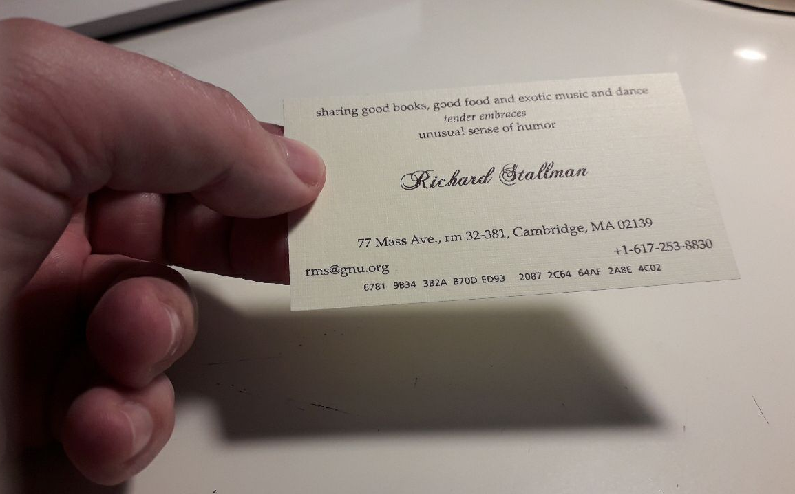

# Tutorial: GnuPG

**GNU Privacy Guard** (GnuPG o GPG) es una herramienta de cifrado y firmas digitales desarrollado por Werner Koch, que viene a ser un reemplazo del **PGP** (Pretty Good Privacy) pero con la principal diferencia que es Software Libre licenciado bajo licencia GPLv3. **GPG** utiliza el estándar del IETF denominado **OpenPGP**.

Para seguir los pasos de esta guía primero debes tener instalado en tu sistema **GnuPG**.
```bash
~$ sudo apt install gnupg
```

## Crear un par de claves (publica/privada) nuevas

## Exportar mi clave pública

1. Una vez generes tu par de claves (pública/privada) es muy importante que exportes tu clave pública para compartirla con los demás, con cuanta más gente mejor. Realmente no hay nada malo en que personas desconocidas tiengan tu clave pública, todo lo contrario, puede ser muy beneficioso hacer que tu clave pública esté disponible y que las personas puedan encontrar fácilmente tu clave para comunicarse contigo de una forma más segura, cuanto antes mejor. Para exportar tu propia clave pública basta con ejecutar el siguiente comando (*en este ejemplo aparece mi clave pública real*):
    ```bash
    ~$ gpg --export --armor jdg@member.fsf.org
    -----BEGIN PGP PUBLIC KEY BLOCK-----

    mQINBFljzlYBEAD2uxIRG7e/kLjlErBVn1V+pVPRCNQ0emj2JYbsr+qUmB2VfULh
    E/zQFimd2NCehijsiAQ/w0MrGtk+fw2LIAprU6+6Mi0fabMkQIP4E2+DFfLhps1u
    o0ebw0VxRGfdW7GzQ85xaChi73P4kgYRT+8SE7M/CUwAH6FwTXQH2UTmrI4C4qGh
    jnkjjSXm7xqH4momGRlgKkgI4zH7PveuXQs46GiOMRy0UOCrrizx/YGoxBNQRnqG
    yAvTJ9xVPuEqk+x8xNKZ1C2ULw7vVlbM9ntYQEXaXTeq/L9iIaAeETRa1vXB6oXv
    STKBmJYwnqDE/bQw72jVVD6H/skH3XTdyKbLbG/2Pc9i+jtvS2KCFOMCp5Sesja4
    eXPV+AP6SBOTqIxYPFtGmCKtL0WdAnUlpUDyvopyhhUMHei5Q/6P/lUhLcA9Cjo2
    qgDw2/vT+/49l/B8W+KJdNPGr7mUF6l7sWbLQ1qg5uXUJDMvVpaYGsQPlLHGmj6e
    5Z5kVFOXlB+RSk0QCOHwmbjNA5hOrT5aRFNO1rkWxA5SN0AHVkcImDCOlNaprLZ6
    249zOcxxF2KYnJxvxurdHc+CqkU8EJY3lWmHpyMOPt5GNeBSHiRX3ECHEKy1CwTi
    mjbYSzqY/CTxT8BFkyGKJn+/1lJcTF0uhHFvDVprlLaFt+uekKwwV4gvFwARAQAB
    tCtKYXZpZXIgRG9taW5ndWV6IEdvbWV6IDxqZGdAbWVtYmVyLmZzZi5vcmc+iQJU
    BBMBCgA+AhsDBQsJCAcDBRUKCQgLBRYCAwEAAh4BAheAFiEElK0Z9JAF7rIzhMIP
    W9zGaNZkjisFAloENpIFCQeFsLwACgkQW9zGaNZkjivgoA//XOR0nQxy8//NbMkP
    hATn0hvhBawGaY9pSXzL5YreEHS2jcOXhJuKrAg8sjwVWKq5tljVqPigthbTQuyF
    0W3JUwv7BGoWOsaUNw9IrlN6EBd5b4baGXwai3+6ZuluScXWw3WuWP+NPsKWd7YP
    S5dpFYJ5X7uNNbYOv3yUc+MZdjZ6FruFeV9QJwnELoFAVZ90DEbvm+7vbwXyaqQA
    sjinIrF1+Lg8LzYpDRjCrs+CzoRkDXK5tV1lE3xtnSh4kMxP0qmiKcq8xb8ozLAd
    pHMiV9YHxcnhn3gosejjmutjSXFNCas3LgRLo+y6vzc3Mrg1om/7jFcGsxPePue8
    kUM2IHJDX3QBsbzXi6NhLBTl6mWAktQ/FWhtjfwAMa+K0+VUaTzzsjaIfKkIOgiX
    Ti7y9D2lj9n16TPUzRCEngaIPyi5Dg8uTqust9Bh/xcq5RNQYsuCqEWJbToMiYxb
    Wz/nlOV0tUNZDZfrJVrHFrXIsiTi9J7kOZUSaIuwH1L2UuVM7a+K41/pSoRHVHa1
    7f9mtl0F165aYPJ7hIIdCGocL6/zx8KVRNjy9t0EgwDCkX1yqepbT29KBSsKdd8c
    KednE/TcdWCR96C8bw2XeoAUiP3tj7Ag4jPr8SXtxB3vncGA5xm4cqtBR/0QpVZj
    Tv5ZAfa6XxnhEaBVwldcJZkIe8OJATMEEwEKAB0WIQSfcjOvhWAUezjq+zIAe3Wd
    +p87gAUCWfoAigAKCRAAe3Wd+p87gLBNB/94w+5zS0vGicirkCxgdu43rVPRXm6D
    oVLn2EdvxwqYA2PWjPLst4qzJbYmcgxhIlFXnNgNIK3F2cwaiaKpIthOH6DBAVc1
    usb0/TGm4jPtRZQeAS0Fe2Qr0upSsSO7xBmtWalKyvA4Q4MixY6Iplb2un2Y+fDv
    QAwYdCkoEu5jP8dHo8HDx3ZbPNJ35UD7NcC2ISMEHaijkFyPCqS4wukq7kL/9yHG
    R00c3bZAMvuocLWOkTeLr0/1ymlYVYf8gVCCNtrRqlo0OljnmKawCZGWnF+6bJyP
    Dpb6KaeZOhxtRcdfPT8DCEsiZovPYNcBxuP2zLYbrXdqk+NWcSPCb58riQEzBBAB
    CAAdFiEEKzAhy+egryva384i/jp1i2rQSZEFAln3qqUACgkQ/jp1i2rQSZFDaQf8
    C71hJBOXB1xFgyeXLkfF4zExVfRUmmnw387MIAXB+Epri6BecuKaUSzE8yp9NvBv
    DFTZqVGD5sZxNsV+1SKbZYxla+J8IT4a0eu8F/8mHEhpD6aVzNXUik02puJct0Yf
    5r4pcrMA22NL/JOvtkAA+JOJ5xD9t+He9zKO1fbryIM0dHZC+ksvQEc6HvaNFoiI
    fzotmRdLqM8ZzsRQpEDbIqmSo2gT9E3QBEYtIVIgjFcP6LbBgpnvMOe2irhpiHQa
    clHkb4uOkGpRUnFYIiyj0mYdtNMrEadYFil4Rl3rNjsvEhDc0la+Nuhmfl5dOPeD
    QYF2tFw2tpINPQRZf0qkUIkBMwQQAQgAHRYhBDDtIEL/mpffHHVGbt5gyzUwGzQp
    BQJZ95vRAAoJEN5gyzUwGzQpc/4IALpBmhE/62/1cp0tYGnPRIlzf/5cd3jF3iKf
    9H1zHMs/X9EQ8B4+udLikjO36JQHWE78kvMN0lmkHl2YAiunha0wi2rysF4aUuru
    mS/PUdFt1rAubNw3yZA7uj+MA9jFYfvsVRGxuouv9QyRgpwqGAdK/vrL9zwwGcsD
    u0LoFiFKQtySVe14aMER+vTIsVLpaQ5w/qx6aSv0akIUatfH7ptz2Zp8WARU6P2G
    jWnaKV1KIfC8f0JV4fi7SlMGMx1lU/GfRxW+VNLCN0aEDaq9BUaUcC6+UT41Plx9
    drXzE17AVcbGOdATPh0Dbfh/Tnfl6ZNigpBvSF282te0B0U+ANqJATMEEAEIAB0W
    IQRX/64jFwbQ2wwfmBix6AHM+KJsDwUCWfWpvwAKCRCx6AHM+KJsD2j+CACS4HRR
    UGe8lmTJBZAHQEKPecEMMZwACElG3P4lf0yZuEhOuWSZDXytoX6MxAytH8D4lztQ
    XuizoYt16MWUY2pKiX0jucVF5/buisKi2fUpIekZzReO5XFAivo/UGd6EN7UebG6
    fekRuP9k6nu05b+0MmGaCZqSrtyFKVkRqChRyHtqXgpWbKbIW836VQY2JoEiuSTB
    PhihCeYbO+X2fQBjnQ2KmU0sVpkGQwtN8K7Ie1dG7YFjJjPRjzM2FfvJOYy1Gyaf
    rehjv/PwxHnlXjOTni20hn56RNMyR4uguAWpbvmqeDKWBT5OMrr7nDu3dk0h0Rak
    CIwcFrxjuXzuLkFoiQEzBBABCAAdFiEEd6oLq/DXadOMY9x6NG91j7d/vLYFAln4
    PHEACgkQNG91j7d/vLYR7wf+PeJjF3O515INI+OcnG8imY1u4Un72mO6G2LSJHPq
    NDW9crgX4MgdZYjHYP/J33VApfOZxazekYrndx9sN6wtW0e7NxAnhpK8xOubGdWj
    MuNWm4jazc9EigwASAWK4QWC6+u72Iqt498aA67A3qXqTacFbVJmc9ChbwGk8dIf
    h5kdhHwiq815+IJYRODWyESH8pAsWYPwB36cEW9gCoCk6GaDCdPn4r7uJky1fmHQ
    0L5EstSE9lOa5tbc0jtFTn7fUog754KLZkdjT9bXgxyQ/076wXoQZrdM0ICQ/sVK
    Xq9sJobOHSfUSRVSCu4Zh1x/fOJE4TbWdI1AOt2jHTKcBIkBMwQQAQgAHRYhBJpx
    K2RTnBKYDEvVUbpkzuyOdxshBQJZ+KTRAAoJELpkzuyOdxshv5AH/38yNmHBakfd
    zkiLcR/Ld40SLz+Xg0TunoWu+rmk8+OFRqKko7ok1q+9deL5p3JZppAFkWZWwws8
    jMZNIFEftBvfMwxPknSiK10iDCXW1BGgZIkiQHk65sft6maacoq+yy/4Je2c51wO
    mEeIIaQnow/SqPCPIJsZp+8aH/hg7HENGmIJGpPOFGYHYfnvAvaQv7RmcxRAMqiV
    NXDTmpHMQb7oJebvSwZWia96EJ4Ncb9vSXV13TibDRX1RclvenTlRn34fuA+TSWW
    K2CPxMSAEw2LKhhfh2w7+S+uZFgvNkQkrXPpUNgA6Xuds/mhPBiHMbFaDaNQ3sOs
    X2SOAJHSoUyJATMEEAEIAB0WIQSfcjOvhWAUezjq+zIAe3Wd+p87gAUCWfEB0wAK
    CRAAe3Wd+p87gAPnCADLoKdYKBlbEPxUf4be3wOChPShA1KgjP8asuhupT+Yus9x
    WH1Fw/QpUXConcA182TQ+IQjGvNSIjsMa1/uFvRW8Y9+VicDuTX8wWGka/sUzjq4
    2J5ov4dtjHFH6Lhfmqpk7Wokf3yuH6OA3cfg5cHvKPGZxD7pCXd5nSwTs3ee1+QU
    2X0yDzr1RQvOl8cVaiuf7ydwW6PqGnt38YRLFCI1Xv9WGhtDMig3pjSHQpwrERvk
    9VZmyRItnlv19NXVd4EvrM9KBiFIJGZPpr+LhNJDKJStTQLXHWvOXf98QZTxBu9Z
    Zj5LiqOw2MmYQDYzxmT+sOVS7yR6OZVQOIqwH6LGiQEzBBABCAAdFiEEsshqoBRa
    XMotaQ2upzaGhyuOJxgFAln2JCsACgkQpzaGhyuOJxioRggAp4lQVNAG7UB4wPnh
    heAit8IMZfEUisyGXv9BhSIMzFtAGkPv9+zRkfxp/7gwXNgResHSQV/d2pinOSSr
    thzEhLcD5SXJfCeLbTKsk/4pRJJtxy5EWXQblWRMbF1nxd169txlBngNrVfu38P5
    MNRRI6gSjUZtnpwmEfj0WjLGhblkkhGTkIOEQwxcFeQ1Aw1rHgBtTN7FKSCdvZBG
    2LRikXPoVyKcxytt1X4v8XDZ8M5T/oZp54w6oWl/iiUz5SMlRcsnLACrfBv+jtor
    DD3WdW/OH9LQR+8ZBNFT0VxhIuZTjSG4rhe2wCAFk5zfB2C6HBdl4G4KfUJU3JU5
    W0auWIkBMwQQAQgAHRYhBMSTacVf9t7ztEvUhLYzsAuzk5KPBQJZ96JvAAoJELYz
    sAuzk5KPXEQH/3a72nWGbYpsHNJfAY7wAw0q17yz29M5JaMZGWg3ASd3+foF0Qep
    dsclowiXuD2Qf4cPRcCO8wt9CkdjBpHkXgU68AEf1jdBCMNBvNxUPA2QxFss9gU2
    WT6cJeuujoQpvdPd1BSOtOR7aKPFQvTmEZjH6lWHyYWd5mQQtXl/WejQCmv1/McE
    Pvvy4L1nyaVORgmD+5fsNtKwXNM7x7SsiC2sojptPLIHjnbu2sUtKgcx4MyOOh82
    STUAJ0hLQhr7B18Zmxemmuqu3qzCRTgm+RzhWyb5648eoV4Pm9+f0+cFNrk32EK7
    o08YleazL1Qk3W9C2iZyhmsCV5E2EvF5hiSJATMEEAEIAB0WIQTbleyw+glK4MK7
    3IGCCjOMd+RdrwUCWfjBXAAKCRCCCjOMd+Rdr/7TCACbrNpJhSdXPKT42iEuLuMD
    7NAm1ncscjVw6/VQ0ei+FNgGpa2vLZSORakak2+HEHavT/82myDlkBcc4pq1ESEl
    eiiHYh8P0glJn0YPU5My18NS+w2xJktQ4QrAfFZpRub80Eh08AJdyzDkna2NWI0k
    fNSblMohxr/2XyrpavAOLiTOH1cxG30WfkQdp3ngsPy6nC036tvi2LvepY9ymqDQ
    FGeN3SAEnybdr9oHnQuzMQEE8lG6kspP0i8Mh/KSngBKVMYiuS60wiiv1DUVMIOJ
    3H2fWVsNGDa6VaPH7tAVoWuS24kkeK4Uqq1T8e9yX7scWMbkrp4Z26+FXrqiodhE
    iQEzBBABCAAdFiEE3NH1KgDeD4hScXm0HSr3iK5ygqkFAln4oCgACgkQHSr3iK5y
    gqnKRQf/b2uNXKbMym7H4JcmWXMx5Q6KHdkqpCZEfd3MYIslwHqSl/JL/VQ+GOEf
    1UI024bmhhRhnCXIzUqmBfIVCOCpeUf8F+hkjx0+45L9gvUSRMbC6B7h3abc/uD5
    Y2z+ep5BW5wm9vzlXs02kiGxle2xHS1GO1Ydec8c/am+Ja/j6D0b+JpuM5Y6qMn4
    8C/LGoXX2d0d/aETMOirewPxfSllnsTt9G4pnC4xrqp+YYpsbD0DGksnJIN6iAgz
    Mq9GXsa4lKbV9W+keMpRV2bCwLV5kqugrmokjHGkul2ZKvI8anu7rPKxz1PQEoM2
    KpuAuDKadymyi2PWBDLXYApfRLyj9okBMwQQAQgAHRYhBAfquT0H1klr+8xBUhbq
    FdbIr+nhBQJaB0elAAoJEBbqFdbIr+nhf/oH/ik5LEctxsqvKbzUxFYWQX/8PqHK
    IXc+rDH2QuCwfJYCWdi8IxcKqH0tG+PkGxAy7CxUUG3gs9wlpDpFJlCwNnsaN7e2
    d3kfclv1lXab3J1egfM9TF15YqCQ46AGbQdP0QNGX7xOo2mYiVR2rW3azpoQQNn0
    qAkosJHYAnwW5MttjffE6u79B9cd8fGpWjDmpyFfJ7WFi7EIuOaLExxbAsNvTLVK
    TxoFbvezHIpUGUTCqE0nACJX5pu8dLqtGJsreG/+MJkNxSoAXCw5bvZnvk5T2zIp
    3YfLBmBK/xMIiLX828OQCWuEPPVftkXcZB2SbuETJJDUz8dH6BcVwFdGRCeJAjcE
    EwEKACEFAlljzlYCGwMFCwkIBwMFFQoJCAsFFgIDAQACHgECF4AACgkQW9zGaNZk
    jiu71xAA7XrtMgiCDrd84xBEvdBAN3cf6evWXPboT7Qwtd/+DkiO90/tsxx8d73e
    rEHMnMsw8S0BOAxbl8j+XYW3EoSnZ7GMFv45am72OXOmxHDsj28vs/IOXlC12Plf
    0VjYimH5hkhGROpA6ACMs1v5YOWCj5E7/xbHdnsrfRT1ixdHaN6riKAaTGBOzk0Q
    Fb1v/UvdE58PshtodHsOaPv5tQ5M1jE3lQaQ7AK+ubxNw/P2S9b6yZYyKdXYzkIY
    pfuCDEO/aF/SEegxiuD4MV7IP9/cLwyxxIOFy6jsWx+yqv//j8TFPAyONwd3pKQ6
    2RZYrqVPEUkFEfPWiOztoHEBgGLcHiB2qDte/zAY7R9PaDTZ4iLI9Yo3Q9tuz7nt
    VLfbAiPI0CvmDC1tpnEYgZC2zqmk0r1OpPSdW4HfrtE9AkrnGH8sRNJvlzXXXePE
    /iBMrneHb+4VNirBbavgEzk7wK98ymBJrXVwfBo+alr2Anaj0YmZ52ScHT8OqoeH
    Qyu8jxDMPWtWHbxVCSLc/lf/8M1Fr9tg6+2Sxsij3YDcn/14hwAqoDefvt4wZKxV
    m6iH+Z0LILr/1YMQ3iuxWw6Qqm1hI5K/Ksm2Jq+Xyk7kYlfHLeT4hyi6iNDUP/+B
    a6kgDsIDqTeVAQnpsTY2tkQOE9IW/M0DnBwiom025E92Jl7Aol6JAlQEEwEKAD4C
    GwMFCwkIBwMFFQoJCAsFFgIDAQACHgECF4AWIQSUrRn0kAXusjOEwg9b3MZo1mSO
    KwUCWgQ2EwUJCCaHPQAKCRBb3MZo1mSOK0uAD/95AcQLueXoNXyDcb3mtE+qK76w
    rG45DVxGtIatGxdnn/TR/KBhDpjHJIWHJ5Ifpkpp/NLPFkZOD8PZ2rq1ZVE4zjc0
    GkT8OU/j44epfl3qSKj+RALbfN43UhX5btsWHJn4oZKbEOY4HJze5mw/hhcCi5o2
    pdl8YphK62yapFWDj5imIHdh7WfLOqBkjO+6F72UDArYfs5ErGUl9ZvmUw04SCDX
    ACaa36gr81tUXQOwnY8XynCpFaUip0fLpeBymhjpeTj4Xd9DEy8tNDxWFhxnQAGZ
    iQpE+IOralcNtzgd6ZjM35Xtg5vzCV6awYxBM/++wKXkVDsD1RaqqI/8jjtvnO83
    1jScdXtOGt10Wzdkk+XXLXKBv6fyzm5BiIa5pW3CUduLkGZoUEn+9/QNsi6Wc76N
    HjhuJkKoh7d5UgYtV2vbqhEErqo9H7ooDFElnL4ZvRxjpp18TM58uTgAj/V7ETqD
    o/zop3DCzQQhT5OwcyrMnkRUZvBRcSv3NiOLrIGHldqz1xecU/fP7wASr2Ipe/fe
    xU+0vO5rVqetUEYnGMuMEJArV4NXqlvg3mNu4g5y/UPcmzSbyDh0E158rfSQl1k7
    ILGHE0PpdR1mK32FOGy+zRkLZMMfBwzXXisQSLEtPlQi3NROri1YTeMNp1X/UbP8
    uGqRy6baOMOaXrlzgokCHAQQAQoABgUCWiAcSQAKCRDxfrt4xh5/aJt5D/9PqTAw
    qxJvaayf8LRQ2VbC5xAue++H7ygT8bB/hfK0V2i1CNIXpcU/tFnoNTcwP8L2juEG
    wypkawmPq9h0FU09J3lcXEULNYOuF2jxJgJFsCzjKhL+D090H3kaoACbTeF0cRat
    +43VTaEOx0aOSLehvdTwO9VpV0ySrmi4TK6UMlIWAcdtzZvkeyjDiaXXcua2w5OT
    nwrloTVVRdwZA5oCeA51RL1WcdvcvuNbgElL0cAux7XfI1PNB0bszQve9oaGwFgk
    9U6c4Md6lox74YzJsV/Ir3tCcPMUt3q9RfkjL1QmE8Px6YcDe4et6KwbZLy9gY64
    w6Qhba/f3al4EjIISRx/MPoNwJZdncNu+697c1mwiAVeMyCDsU/lZ7Q8qyP9B5AE
    jarqnzf0dQ+FDsfXbTFekM6V5k5leWnbtvMuodMqjyqgFXI/HdX9TRYfCjXe6ywX
    Mi9OksZgF8geZVuXcv4q1kGSH+Wg455YxVmPCM/81LX7kkz+UYAFFldMSJbd89uD
    Uyl2e3DWu2bDCJOiRhbim8GnlsTj1tT//J68Vtja1oycnFtVCBQIaPGyEvsIkU7X
    9VnGTECvty+6YrwxVvZMaXvYRgUxzHmdw/j1vSDZYsLCyPinJxz7lIvp2zBKBWGo
    eGY2PaVjKOdHN0LuM2p+Gz2Kk3xPyQcf69HnV4kBMwQQAQgAHRYhBP7NvyBfFRYz
    AfBn4LHgHLeqP5PeBQJaWfmIAAoJELHgHLeqP5PeUqAIAKzPn4bRjD0sIYOL8j9x
    L8fJi6yVXyLc/TBzrtDJL//vVYU4dY3Nl2v2DI7tSlD/Og0KO5OPczN6KKZE4cRY
    Bd/G+klkQ0LBnKb8Y4mYabQBILtL54wzq5d0tdsDJ32jMcI0ypt0wKKITmIRxJCV
    7NR21GGryYhHdoAfSP1WphFA/rpa6B8Eh4f/1b+E+SG666Ui3YpCstzM0YFrWcZG
    0faKP/GBGl8GVEkm7K2XHtdB8S9xd33e8n7WYP72hgL8TLB3/Fi8XYRsfZ82PEei
    Gwr0P6Majqob92XhA0On4CN1KbC3eYwX3c9q02WP9RxT0QaOlkzDT9P46AYpO+XP
    X1OJAhwEEAEIAAYFAlpKLH4ACgkQ5NATkF2hIzHPrw//ZEUt1UabmKTI3GYe9qM8
    hyYy+eCMyz8D9YrBjR33E6hIRO7o9J6imLMV6L5koPWvDrMo8JAXnT8KF/ablDnI
    NwxbuCPPmK8BbElGksWAE24lET4uALJN5eIgRl+yeUV4cyIMtJrq+ttx27adRdW9
    MkSvAWn2dz4fMztFgS9T2sk7Pp70FqUsIgoRb8DROyzbP6VKKzwCe0pv89DCZGvt
    ZODw2lybQc79g/OJFp8089RWFGtfYWhL/Csm04bAOl3Xi01S0tRZptLX8wjWrVxo
    Kqn5XLihE/hrFter1BH+UYuMFiihpTqK2uu+/pRulAN3zsV14JMo0LYzJK2gseQP
    NPme0CFi2lPHU0ei4yDKxnihgOCH8CN0vXyXGeO06UpvEcouA2POR8mSUHWlMY1f
    i2cHXMiEQZpVrQHE84PFQ0klOFW57FyFebz6L9En40FGgNY7ipFG1QTWVpbCZj+h
    LTwHm0+RzXDKy3wEvMVO7AXEl77TcUsHBiMGwFioYMUYV2HF4a4BdT6thogBPvFc
    JCT1a6SsinFGdGnqzHPol7s1ZSNdPaUEQ7Qp847yFnb1cB1v4PxZzHQ7wAyQdhTq
    PZv/HUb15EV8GzZ6V0yxbtUEsz7MalfLAWclJZFGqPcL4b2piQc+8QZnuu9AuXRI
    o1aSBYYr4hZj/8JWctyj+MmJATMEEAEIAB0WIQSuEJMIEmsEYWTZk5M7MnmsBezC
    BwUCWwBxrgAKCRA7MnmsBezCBy4vCACwr0512nBdGwYqR3zI9nbyphpXhgbE+2hy
    RevRAlBtIUkNyP8+/R4DaijXjPODr/+w4Yc3/16lItcdhaj2aJo1rgKbzjM5TVtl
    XjBqMnSaEA6Ypalzua4g94fyYhODSruNlkmejNfNLJEpY6ZbbNPdmMSBSfPCM6kD
    VER50emuHuMZOlPPtDD4laMZXlMyEIaO4NNtecgQ1VE1I1HF8eH39EcGy5v5nVXH
    n8ZyJjpHtXo9Y14D7Laa4q3QNjWCQsK3tJcFcDyBqOLesRzmjTNgbe/pE2nqL28s
    X+eR1Uw1/OLN0duA+hFHeM09q4s19D0TahmY2j4lH/9hWTvaT+S0iQEzBBABCAAd
    FiEEd66AW+pANUyia04S/tWXNF4FqKcFAlt11eUACgkQ/tWXNF4FqKdieAf/SBkZ
    PHHoFv3GGD9GwoU5eFYHT/85PFXVola95crvY3KOQqBsalagX+3vFOSW402xTxBk
    wj3MJ/+C23ow2Ed8+5cXjzGiAp26+RqH+WEbRTfwkYFWKZ4DFO+J8vQK8x+PaYTz
    CMtEAcigcS37flu3zqnmllE90dRAOGIQ61XkKsqWZGMDh9FLgbPEgO+FtqoLUiZA
    Q4/+ukgszURsTD4gyQlcUeTwhqmO+Yfe6ZkLw48302oFJ7VhnTEhg466901kxxAR
    yQ+Nlu1LPNeqe2Fr6msUtWh6LLjCcIoMBfVYyIjQ+VqMIp7MmaoCOqqILQods2jz
    OcA5GKLR1f9QeMUaNokBMwQQAQgAHRYhBE76ORBLjouNrWAQbv2oNlCDOziWBQJb
    2D1XAAoJEP2oNlCDOziWL1sH/A946fi2/W/2EAXHllxnWPqFpJVYRZXD6eZnrVIo
    QkjLqfkMDOISuIhrWojegT4dPEJRd0dxU1iZGboWqNemt0fc6NtK1sAyYVOqb2pS
    4d5mBP394AWnvIRgSWNVBvwYESd+FCpG232Okjy0U2rpBBwEEAOhwfAs1xwEV+9I
    +kDtXCPdsyarHkX+IZs/ulF6SaKWUBeExuyQPCqpkl/rHY1CizHO2a1TQsXCujn0
    NmQvtILJVKJMK4NPzmqOLIjobsioGoUMcUZ+jzyFxg4Vy7UZ4PFHGyN26CpUou+T
    iW7QYMS49jOK3hhQdSXJGrsnKzvjeTJ4gwLjmZdlG48XZAqJATMEEAEIAB0WIQSF
    E6wxiZacsWD6jf5ezCw7RUyM3QUCXBU2MAAKCRBezCw7RUyM3XsTB/4tV6HWraDe
    eFVLrstItAnUE/LgmO2mlVo2TMrdsifiVJBWfkiaBD+zyji78Ds99VTcUjKrSXqQ
    Zqi67EARL4u/HirNBbHQhN3KFb3WkauoP2rgxba7KnWmbC50KFddAwSGbzx+csqr
    4l7HiOKoziWD6br/9CL73cXAu/mVCOvIxXC+3zywnMLcFMtFbmZ7L3Bdza7H1Ihr
    vHRmOvatLxMpIkL8n461Gb/KHtNAJ4M4LkSAfIWzWs8q4LcaJHLCLx6MVjsKXKvm
    jDJBnSUVNlgmVTngKBalIDZojA97FyZYL4MzTSR5Wy/JcRWsngsP+05ZxXOC/6gc
    XGabjaroVrx1iQEzBBABCAAdFiEEhu5S8nS3+JiWi43aECrRKzwzvVcFAlw6GssA
    CgkQECrRKzwzvVf6vAgAkXxc/BZRyBXxSh3bH/jrOelwKpbpnxXRwvkxrKehDIvm
    AT4zB2S4o3KO9DFgZm6TXqJmhosyvK/5/s3pij6BdhUIJuOk0227DxQwEL1B/7yO
    DhUOZ1kR3jjpEZn+g/OvGgmsLvMD163e+jzRYzGwZ1OpIhck15WuJ/hhrgcFYjts
    w5LiXkAb2Gt84nzvYf1rGh1JEkMAZq4p37LfSUxhZX+wGoTQ8+SV5Vj5TZtEI9Yn
    9ucdvQi9SZpjribosghRG024dTux20hIGn/X5bElEWpX/DNL/cj2BA+PWkspGhDm
    Q5uJH5MPKQX4O4HD1bQ5jgX/NJgXA6wP7lvQJucx0YkBMwQQAQgAHRYhBJnM+2sk
    33/2sTscJz92A/CeAopaBQJcZw9TAAoJED92A/CeAopanBcH/2u3Xb6EhwH2cUMb
    VBJGBuBxZ2zgYc8mVOD62JcKVS9QwaHYmSosp3J39RVI65C4VS2IEYpN6wX2hNKy
    nHuhuXq5RGx2WUr1ONrYBqEh+ROfubaaPAOavNFpCiZzZPrrJbiz3GKuYmT5pkWP
    6I920bil9CSqhWeiBtYWCJz5HUXvwXmsWgAqTL6OHqMATWwqENi0jrWM3SxTsf5j
    tf7XRZYCuLK2dRocHAg9j9cQeSEyLfejjA6ZkVQCYEQE5f6a+pEWtEjob0c2JoMq
    MIA7M+xEmYi7NZr1tj2j5L5T0Zc+RHjm1YHiVVGMjP/gttvvBuH0xknbObZ4tDsE
    T/8gGv6JATMEEAEIAB0WIQSiCFSNmxbTJV95vII6Pj7UZmzybAUCXER9tQAKCRA6
    Pj7UZmzybJSnB/9rte50l3Eyy7QKKgG/QW/Ajl9ekwyu+yLkIoWDHO1WCNzbWiKZ
    M+yBBYMwvFbBIjyUxnjUEYuiNU0NmWfRCEqrGaOhb4PJuwd+8lD3e16VDum6Ns+m
    kqj6rRMcR2xKD2EZ/hW7zF0HLwk59ooO8xMicuBwftaUP8+8Hr80MvYeByFLb4Ar
    mJAUblWKdOviMcfwGRs+0cs8YxkJTkMHPW+Lb1z0ydpWNC9UW53lRTGIGZwjE/4H
    51eUV1PtvJtJNYmw77WKhwqONGp11OWYmXWh/eoxTEishpJKiCFvL1eh/F+MeNfZ
    tIyONJOIgnndQoMeJgzlzLBJnRoT4YlvQY37iQEzBBABCAAdFiEEoghUjZsW0yVf
    ebyCOj4+1GZs8mwFAlxEg9cACgkQOj4+1GZs8mxPWAgAijKJ/NDYgVwUWNQNbSj+
    Wql01xmpc5hPEu8T7m91byGvadgyVNkGH55xi3a74uPIOeGholmNO9SboBuIFCwg
    Kn4koH9RfKw/fpoXM6+2gAb0F7Xc3UqoFI6Kq/+EYLZqoZzY1ken07d5Wb7OdMFz
    6ut1zaEtZ7d3Eb1FcrOtO+Zsr6bdNtpZhCMSHa6zdcnTx3pvxssDmiu1ol0gGw86
    l8gsaDjVMIy0io0flclt3WVMkeoel3SQwuYtv+pNn9QREAMXylooTaImbAXTX5ad
    NisH9xA5VE4n3VuI7QI3MY5LvEEg1brizc3iTu+qI98wp609haD28bbNeYmAMCKI
    EokBMwQQAQgAHRYhBMx4gFz2HGh/a8WAuH2YSfxrWOr4BQJcM4wHAAoJEH2YSfxr
    WOr4yZcH/2tRkBvicYFgKCBMIVRdOmGvPeOdg8niakjcoPPun/dh3VMfaXmxlmgF
    Q9YjEaS8DjKhwpxnaUue6Mj1kz3RHuavMjDEWxS8q7bGK/VqDGrVENHJY15jG3we
    zoUp1UtCXcjyobS3Lt0CoEONnIA8qHGWgNXKFdHXr5U7B6F0T+Fi2k+IMSyXEUsO
    kregXzC535CpV1O8el1Ykqk7NQ3J+tojoykCJtt7t/aJu4vIMmsSkhZfU+t/9Z+j
    dJKvtUvlPzR9GHZcQtb+yWWX4tY7QL6ruoozUuQolfgmwdLBS6RuHqCFPzV65e8p
    LVv0pvuUvUu0BRh1CzFfqibwgHeqVmmJATMEEAEIAB0WIQRkYp3aXoqiZrwKORan
    5mLlYZaGiAUCXPpR+wAKCRCn5mLlYZaGiOcXB/wKQDzhnfMs+x20tVYGl39KzxG6
    bnNho9QC+6x/rB8ei0C+DYWTBkuSn5fEuO7L9Zq7AZ7Bz1VnwEtSJH5pm4ruYX8l
    LHaE1NWg9AB75V33R339HR1mZoqMjTm7Dy2Q9qCenfYHcdHPk0maNW9fMFLaXa8T
    jrM8FwKvwbgWMbFYwlBfrFrIJyvybQHwf4NjZ/3xp9NtgBNUhr1TdOgpNXw44If8
    yuaKookbdvBM583V+ecS8T18gPYzkqquCehCjaqpHn4GeF8Qhw/xIgfDSKJJM2jD
    k2LpurF9ILeGRzOcR+VDAzYPW47R05iMsz1pvQcF+6bUjo8Jt1CHEYONhAMFuQIN
    BFljzlYBEADOmzJLarkpaHQNwA5s1Z0bv4oQNfCcHGC8m4c9bIt+xqzuwdZ0LHQb
    K+b9mWYsqw1ges6vy0pkWjUSEc1tEGt94yYn1UOa9/59uF2IettNgDS8obXubE3P
    8RNwNHhbcorJhJzsjuiaGylOC3birhXRpcTnW8tF3IhDfn/78/lK3np/426S9ZZk
    poyQhBeWEWYfarTdG3l+WxNaS+Zydw35O7hYjUQSeJew3Iyx4ArPyqcxkw9q3hCK
    Us/O6VZuPbD/x4/sC9a5Z6sF572rqx8sXWZGAojfZELj9Fsw+gWPoECvMcXTmtzg
    EmyPWl0NZXpysMqDKTF+NwLfxWrSWkJhi+3Q1N2n8mAKBnQu/yXmbh6TRapYZHdm
    3YbHmRkXGTYAgzFwehCjV8Z+GkE56DLc0NxdBMCBXE93r1pGBPlSFEqCH9xsCjjf
    E2Q2ajLjmeyDYbnlzTsJNYhIgLOiUVUmmcnPjLIyLPXf7foMRrWFayny07AklWA+
    XfApUkYCmQ52w830NjlzzsIq9I77QiwBXvzymZaeumiUggeovQNk1zYNVuAW9+Dc
    9YkzhFMVP8adYsh3mPb7NmBKgBl/lQ5g1Jluu55O983cHr2RVuZ6PCP2l06RdFI9
    P9GOLmlGOUTyllzGqCE5TDPkKwBcOgZUo9iXR2RRZVwlowBZjYetRwARAQABiQIf
    BBgBCgAJBQJZY85WAhsMAAoJEFvcxmjWZI4rnXcP/0+tfzQ8tKcuXWLbij/p7Ygf
    AwCl3zOQYcP9WJLzunCp5NSwnOc3HnDYSfYfvj7OxTOQsN+vyzLInwmuWinzJCkI
    vQzNVHFmhFjOUvk5SFjl7toz82oKvw10ROGeJp8GpBxS0ZcPtMJEuEb3QGUNKR/S
    7M/9y/Y+0pTdn2wA2UZLz9ep2CkWTWvfsSFpIjuJSScbU2wOQpaA3dvyiEx+lH4y
    wmm1t45+MotQjPX22vRJgs59QWVU9ZJibo+adZKAsiAS64Qt/+jBnUkHl3f025U0
    LnlQURVnisBfrl84gScCfIx/wllonfiORTenDd0ycfT2rDKc6cPYHusvIuYc7q8O
    yO67Uajfb5Qx5YRXxZKLlE6PKx3I+g7Mo2IObjCWsbdUvLY2PjpUZVGdVf+XAmJ9
    TNNeihtzbJn5zeq6VYJlNtlE+Qol22yXAshhEj0u2h3bVhDTSmbfWohdY6FHGyFj
    jpdFNiIxjfZIrKux9w8/pCGR1B1HF0zaB7CtO77d1PayNCTlVF9QXzKA1VFcbHEB
    CRutaOvCxbkcf/sfiS0bDRmcYrF/IWbwKCD/QhHoiDSWcxh/40bNUS1CVmHNN2i2
    yHdJLsA+ZpQiSIFgjFAX7YVFO/H1BQroOSp6sK4atzlRT+eP3+9zSj3nGri3Iavk
    a3C0RYMEv+HI5gQgguyc
    =2k8o
    -----END PGP PUBLIC KEY BLOCK-----
    ```

2. Puedes ejecutar el comando anterior de la siguiente manera para que en vez de ver por pantalla la clve pública se vuelque en un fichero al que he llamado `jdg-pubkey.txt`:
    ```bash
    ~$ gpg --export --armor jdg@member.fsf.org > jdg-pubkey.txt
    ```

3. Tanto si obtienes tu clave pública por pantalla en modo texto como si la vuelcas en un archivo, puedes compartirla con tus amigos, conocidos o con cualquier persona, enviándosela por mail o publicándola en algún servidor de claves como, como [Rediris](https://www.rediris.es/keyserver/) o [MIT PGP Key server](https://pgp.mit.edu/).

## Importar clave pública de otra persona

1. Primero hay que hacerse con la clave pública de la persona con la que quieres comunicarte utilizando GPG o PGP. hay que tener cuidado a la hora de obtener claves públicas a través de servidores de claves, es una opción pero no es la mejor opción, pues algunos podrían contener claves públicas falsas o de otras personas bajo tu nombre. En los siguientes puntos explico cómo verificar cual es la clave que realmente te interesa.

2. Una vez que tenemos la clave pública de la persona en cuestión, hay que importarla mediante el siguiente comando:
    ```bash
    ~$ gpg --import rms-pubkey.txt
    gpg: clave 2C6464AF2A8E4C02: clave pública "Richard Stallman <rms@gnu.org>" importada
    gpg: Cantidad total procesada: 1
    gpg:               importadas: 1
    gpg: marginals needed: 3  completes needed: 1  trust model: pgp
    gpg: nivel: 0  validez:   7  firmada:   1  confianza: 0-, 0q, 0n, 0m, 0f, 7u
    gpg: nivel: 1  validez:   1  firmada:   0  confianza: 0-, 0q, 0n, 0m, 1f, 0u
    gpg: siguiente comprobación de base de datos de confianza el: 2020-10-18
    ```

3. Para estar realmente seguro de qué la clave pública que has importado es la de esa persona, se debe obtener el *fingerprint* o seguir una cadena de firmas de personas de confianza. Una manera fiable de obtener el *fingerprint* de una persona es dándola en mano, a través de una tarjeta o papel donde esté escrita. Esta práctica es muy habitual en una [Key Signing Party](https://es.wikipedia.org/wiki/Fiesta_de_firmado_de_claves).

    <p align="center"><a src="img/gpg_00.png"></a>&nbsp;<a src="img/gpg_00.png"></a></p>
    <br>

4. Verificamos si el *fingerprint* que tenemos para comparar -*en este caso el que aparece en la tarjeta de RMS*-, coincide con el de la clave que acabamos de importar:
    ```bash
    ~$ gpg --fingerprint rms@gnu.org
    pub   rsa4096 2013-07-20 [SC]
          6781 9B34 3B2A B70D ED93  2087 2C64 64AF 2A8E 4C02
    uid        [desconocida] Richard Stallman <rms@gnu.org>
    sub   rsa4096 2013-07-20 [E]
    ```

4. Si los *fingerprints* coinciden podríamos aumentar el nivel de confianza que tenemos con esa persona mediante el siguiente comando:
    ```bash

    ```

5. También podemos firmar la clave que acabamos de importar. Firmar una clave significa que confías en la clave que se se te ha proporcionado y que has verificado que está asociada con la persona en cuestión. Para firmar una clave simplemente ejecutamos:
    ```bash
    ~$ gpg --sign-key rms@gnu.org

    pub  rsa4096/2C6464AF2A8E4C02
         creado: 2013-07-20  caduca: nunca       uso: SC  
         confianza: desconocido   validez: desconocido
    sub  rsa4096/2F30A2E162853425
         creado: 2013-07-20  caduca: nunca       uso: E   
    [desconocida] (1). Richard Stallman <rms@gnu.org>

    pub  rsa4096/2C6464AF2A8E4C02
         creado: 2013-07-20  caduca: nunca       uso: SC  
         confianza: desconocido   validez: desconocido
     Huella clave primaria: 6781 9B34 3B2A B70D ED93  2087 2C64 64AF 2A8E 4C02

         Richard Stallman <rms@gnu.org>

    ¿Está realmente seguro de querer firmar esta clave
    con su clave: "Javier Dominguez Gomez <jdg@member.fsf.org>" (5BDCC668D6648E2B)?

    ¿Firmar de verdad? (s/N) s
    ```
Tras pulsar intro GPG te pedirá que introduzcas la password de tu clave privada GPG. La introduces y pulsas intro de nuevo, ya habrías firmado la clave pública de tu amigo. Firmar la clave significa que verificas públicamente que confías en que la persona es quien dice ser. Esto puede ayudar a otras personas a decidir si confiar en esa persona también. Si alguien confía tí y ve que has firmado la clave de esta persona, es más probable que también confíe en su identidad.

## Cifrado simétrico de ficheros

A continuación explico de forma muy breve cómo se cifra un archivo cualquiera empleando cifrado simétrico.

1. Para este ejemplo primero crearemos un archivo `prueba.txt` que contendrá la cadena de texto "*Hola*".
    ```bash
    ~$ echo "Hola" > prueba.txt
    ~$ cat prueba.txt
    Hola
    ```

2. Si queremos cifrar el archivo `prueba.txt` con un *passphrase* ejecutamos el siguiente comando sobre el archivo:
    ```bash
    ~$ gpg -o prueba.gpg -c prueba.txt
    ```
Nos pedirá insertar un *passphrase* para su cifrado.

3. Debemos recordar este *passphrase* para luego descifrar nuestro archivo. La opción `-o` es para indicar el archivo de salida ya cifrado, y la opción `-c` es para indicar que se va a realizar un cifrado simétrico (por defecto AES128). Si se quisiera cambiar el tipo de cifrado se puede sustituir la opción `-c` por `--cipher-algo` y a continuación especificar el tipo de cifrado, por ejemplo:
    ```bash
    ~$ gpg -o prueba.gpg --cipher-algo AES256 prueba.txt
    ```
Los algoritmos de cifrado simétrico disponibles son: `IDEA`, `3DES`, `CAST5`, `BLOWFISH`, `AES`, `AES192`, `AES256`, `TWOFISH`, `CAMELLIA128`, `CAMELLIA192` y `CAMELLIA256`.

4. Una vez hecho esto, se puede listar el contenido del directorio actual para ver lo que se ha generado.
    ```bash
    ~$ ls -lrt
    -rw-rw-r-- 1 jdg jdg     5 may  5 17:53 prueba.txt
    -rw-rw-r-- 1 jdg jdg    85 may  5 17:53 prueba.gpg
    ```

5. Si queremos ver qué contiene el archivo `prueba.gpg` generado veremos que ya no tiene el texto en claro y está cifrado.
    ```bash
    ~$ cat prueba.gpg
    ??K0pF?%<??Z?8??>??Tgh???_u???O?
    ????8a?
    ```

6. Ahora ya podemos guardar para nosotros mismos o hacer llegar el archivo a una persona que conozca la *passphrase* para descifrarlo, de un modo seguro y fiable. Para descifrar el archivo bastaría con ejecutar el siguiente comando:
    ```bash
    ~$ gpg -d prueba.gpg
    gpg: datos cifrados AES
    gpg: cifrado con 1 frase contraseña
    Hola
    ```
Nos pedirá insertar un *passphrase* para descifrarlo, y si lo introducimos correctamente aparecerá el mensaje en claro que está en el archivo original.

Si lo que se quiere cifrar es un conjunto de archivos y directorios bastaría con empaquetarlos y/o comprimirlos en un archivo, por ejemplo `.tar`, `.zip` `.gz`, etc, y repetir el proceso de esta guía.

## Cifrado de ficheros con funciones hash


## Cifrado asimétrico de ficheros con clave pública

1. Para cifrar un archivo con clave pública se ha de ejecutar el siguiente comando:
    ```bash
    ~$ gpg -e -u ​"mi identificador"​ -r ​ "el del destinatario"​ prueba.txt
    ```
Por ejemplo:
    ```bash
    ~$ gpg -e -u ​"jdg@member.fsf.org"​ -r ​"rms@gnu.org"​ prueba.txt
    ```
Tras ejecutar este comando se generará un nuevo archivo `prueba.txt.gpg` que solo `rms@gnu.org` podrá descifrar con su clave privada, pues he utilizado su clave pública para cifrarlo.
